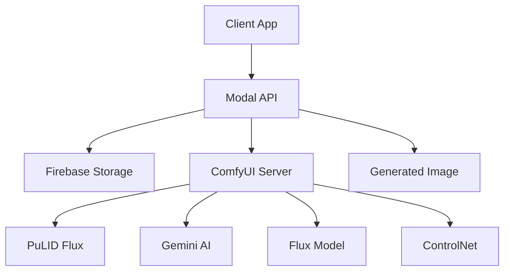

# comfyui-pulid-photobooth
AI-powered photobooth with face identity preservation using PuLID Flux
# 🎭 ComfyUI PuLID Flux Photobooth

An AI-powered photobooth service that transforms people into different scenes while preserving their facial identity using PuLID Flux technology. Built on Modal.com for serverless deployment with Firebase integration.

[](https://modal.com)
[](https://firebase.google.com)
[](https://github.com/ToTheBeginning/PuLID)
[](https://github.com/comfyanonymous/ComfyUI)

## ✨ Features

### 🎯 **Core Capabilities**
- **Face Identity Preservation**: Maintains facial identity across scene transformations
- **AI Scene Generation**: Gemini AI transforms scene descriptions intelligently  
- **Multi-face Support**: Handles multiple people in photos automatically
- **Style Transfer**: Van Gogh, digital art, photography, and custom styles
- **Pose Control**: Advanced pose detection and preservation
- **High Quality**: Flux-based generation for superior results

### 🚀 **Dual Workflow System**
- **Original Workflow**: ReActor face swap with SDXL (backward compatible)
- **Photobooth Workflow**: PuLID Flux with advanced scene transformation
- **Unified API**: Single deployment serving both workflows
- **Scalable**: Serverless architecture with automatic scaling

### 🛠️ **Technical Stack**
- **Backend**: Modal.com serverless containers with GPU support
- **AI Models**: Flux, PuLID, Gemini AI, ControlNet
- **Storage**: Firebase Storage for images and metadata
- **API**: FastAPI with async support
- **Client**: Python SDK with examples

## 🎨 Example Transformations

| Original | Scene Prompt | Result |
|----------|--------------|---------|
| Family photo | "in van gogh painting style during harvest" | Van Gogh style artwork |
| Couple selfie | "on mars wearing astronaut suits" | Sci-fi space scene |
| Group photo | "as pirates on a ship" | Pirate adventure scene |

## 🚀 Quick Start

### 1. **Prerequisites**
```bash
# Required accounts:
- Modal.com account (with GPU access)
- Firebase project  
- Google Gemini API key
- GitHub account
```

### 2. **Clone and Setup**
```bash
git clone https://github.com/yourusername/comfyui-pulid-photobooth.git
cd comfyui-pulid-photobooth

# Install dependencies
pip install -r requirements.txt

# Configure environment
cp .env.example .env
# Edit .env with your settings
```

### 3. **Configure Secrets**
```bash
# Firebase credentials
modal secret create firebase-secret \
  SERVICE_ACCOUNT_JSON='{"type": "service_account", ...}'

# Gemini API key
modal secret create gemini-secret \
  GEMINI_API_KEY='your-gemini-api-key'
```

### 4. **Deploy**
```bash
# Deploy to Modal
modal deploy comfy_api

# Get your API URL
modal app list
```

### 5. **Test**
```bash
# Test photobooth workflow
python client/photobooth_client.py \
    --api-url "https://your-app--api.modal.run" \
    --workflow photobooth \
    --session-id "test-123" \
    --scene-prompt "in van gogh painting style" \
    --gemini-key "your-api-key"
```

## 📡 API Reference

### **Photobooth Endpoint**
```bash
POST /photobooth
Content-Type: application/json

{
  "session_id": "unique-session-id",
  "scene_prompt": "in van gogh painting style during harvest",
  "gemini_api_key": "your-gemini-api-key",
  "style_strength": 0.85,
  "guidance_scale": 3.5,
  "num_steps": 16
}
```

### **Original Workflow Endpoint**
```bash
POST /job
Content-Type: application/json

{
  "session_id": "unique-session-id", 
  "prompt": "beautiful landscape"
}
```

### **Get Results**
```bash
GET /photobooth/{job_id}/{session_id}
GET /job/{job_id}/{session_id}

Response:
{
  "base64_image": "data:image/png;base64,iVBOR...",
  "signed_url": "https://storage.googleapis.com/..."
}
```

## 🎛️ Parameters

| Parameter | Type | Default | Description |
|-----------|------|---------|-------------|
| `session_id` | string | required | Unique ID for Firebase storage |
| `scene_prompt` | string | required | Scene transformation description |
| `gemini_api_key` | string | required | Google Gemini API key |
| `style_strength` | float | 0.85 | Face identity preservation (0.0-1.0) |
| `guidance_scale` | float | 3.5 | Generation quality control |
| `num_steps` | int | 16 | Sampling steps (more = higher quality) |

## 💡 Scene Prompt Examples

### **Style Transformations**
```
"in van gogh painting style"
"as a digital artwork" 
"in anime style"
"as a renaissance painting"
"in impressionist style"
```

### **Location Changes**
```
"on mars wearing astronaut suits"
"in ancient egypt as pharaohs" 
"in a cyberpunk city"
"underwater as merpeople"
"in medieval times as knights"
```

### **Combined Transformations**
```
"in a van gogh painting during harvest season"
"on a pirate ship in oil painting style"
"in space as astronauts in realistic style"
"in ancient rome as gladiators in fresco style"
```

## 🏗️ Architecture



### **Components**
- **Modal.com**: Serverless container hosting with GPU
- **ComfyUI**: Node-based workflow engine
- **PuLID Flux**: Face identity preservation model
- **Gemini AI**: Scene description processing
- **Firebase**: Image storage and metadata
- **FastAPI**: RESTful API interface

## 💰 Cost Estimates

### **Per Generation**
- **Photobooth**: ~$0.025 (30-60 seconds on L40S)
- **Original**: ~$0.015 (15-30 seconds on A100)

### **Monthly Estimates**
- **100 generations/day**: ~$75/month
- **500 generations/day**: ~$375/month
- **1000 generations/day**: ~$750/month

### **Optimization Tips**
- Use `container_idle_timeout` to balance cost vs latency
- Choose appropriate GPU for your volume
- Batch process when possible

## 🚀 Deployment Environments

### **Development**
```bash
modal deploy comfy_api --env development
# URL: https://dev--your-app--api.modal.run
```

### **Production** 
```bash
modal deploy comfy_api --env production
# URL: https://prod--your-app--api.modal.run
```

### **Environment Configuration**
- **Development**: A100 GPU, 5min timeout, verbose logging
- **Production**: L40S GPU, 10min timeout, error logging only

## 📊 Monitoring

### **Health Checks**
```bash
# Check deployment status
modal app list

# Monitor logs
modal logs your-app --follow

# Check resource usage
modal stats your-app
```

### **Key Metrics**
- Generation success rate
- Average processing time  
- Cost per generation
- Popular scene prompts
- Error rates by workflow type

## 🧪 Testing

### **Unit Tests**
```bash
pytest tests/
```

### **Integration Tests**
```bash
# Test both workflows
python scripts/test.sh
```

### **Load Testing**
```bash
# Test with multiple concurrent requests
python client/examples/batch_processing.py
```

## 📁 Project Structure

```
comfyui-pulid-photobooth/
├── comfy_api/           # Main API code
│   ├── __init__.py      # Modal app with workflows
│   ├── container.py     # Docker container setup
│   ├── models.py        # Model downloads
│   ├── nodes.py         # Custom node installation
│   └── workflows/       # Workflow JSON files
├── client/              # Client tools and examples
├── tests/               # Test suite
├── scripts/             # Deployment and utility scripts
├── configs/             # Configuration files
└── docs/                # Documentation
```

## 🔧 Configuration

### **Environment Variables**
```bash
# .env file
MODAL_APP_NAME=comfyui-photobooth
FIREBASE_BUCKET=your-bucket.appspot.com
DEFAULT_GPU=L40S
ENVIRONMENT=production
LOG_LEVEL=INFO
```

### **Model Configuration**
Models are automatically downloaded on first deployment:
- Flux dev (GGUF format) 
- PuLID Flux v0.9.1
- ControlNet Union Pro
- Face detection models
- Upscaling models

## 🛠️ Development

### **Local Development**
```bash
# Install in development mode
pip install -e .

# Run tests
pytest

# Format code
black .
flake8 .
```

### **Adding New Workflows**
1. Create workflow JSON in `comfy_api/workflows/`
2. Add workflow method in `__init__.py`
3. Update client for new parameters
4. Add tests and documentation

### **Custom Models**
Add models to `models.py`:
```python
CUSTOM_MODELS = [
    {
        "url": "https://huggingface.co/...",
        "directory": "/root/models/custom",
    }
]
```

## 🆘 Troubleshooting

### **Common Issues**

**1. Job Timeout**
```bash
# Increase timeout in container.py
timeout=60 * 15  # 15 minutes
```

**2. Out of Memory**
```bash
# Use larger GPU
gpu = "H100"  # vs L40S
```

**3. Model Download Failures**
```bash
# Check network and HuggingFace access
modal logs your-app | grep "download"
```

**4. Gemini API Errors**
```bash
# Verify API key and quota
curl -H "Authorization: Bearer $GEMINI_API_KEY" \
  "https://generativelanguage.googleapis.com/v1/models"
```

### **Debug Mode**
```bash
# Deploy with debug logging
modal deploy comfy_api --env debug
```

## 🤝 Contributing

1. Fork the repository
2. Create feature branch (`git checkout -b feature/new-feature`)
3. Commit changes (`git commit -am 'Add new feature'`)
4. Push to branch (`git push origin feature/new-feature`)
5. Create Pull Request

### **Development Guidelines**
- Follow PEP 8 style guide
- Add tests for new features
- Update documentation
- Use type hints
- Keep functions focused and small

## 📄 License

This project is licensed under the MIT License - see the [LICENSE](LICENSE) file for details.

## 🙏 Acknowledgments

- [ComfyUI](https://github.com/comfyanonymous/ComfyUI) - Workflow engine
- [PuLID](https://github.com/ToTheBeginning/PuLID) - Face identity preservation
- [Modal.com](https://modal.com) - Serverless deployment platform
- [Flux](https://github.com/black-forest-labs/flux) - Image generation model

## 📞 Support

- **Documentation**: Check `docs/` folder
- **Issues**: Create GitHub issue with reproduction steps
- **Discussions**: Use GitHub Discussions for questions
- **API Issues**: Check Modal logs and Firebase console

---

**🚀 Ready to transform photos? Let's get started!**